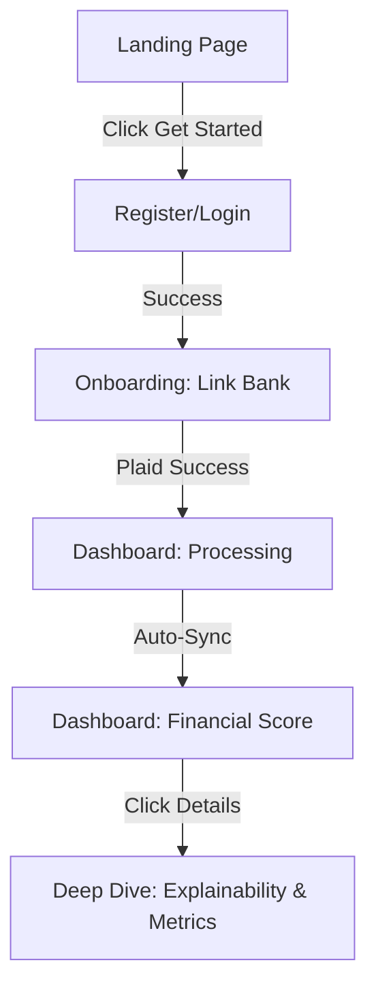
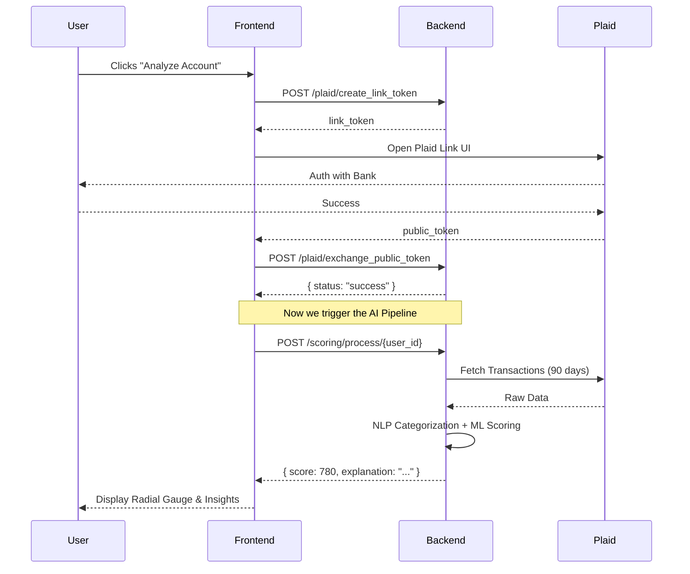

# 🎨 David Protocol — Frontend System Design & API Mapping

This document outlines the end-to-end user journey, UI architecture, and exact API mapping required to build the David Protocol frontend.

---

## 🗺️ User Journey Flowchart

---

## 📄 Page-by-Page Input/Output Cycle

### 1. Landing Page (The "Wow" Factor)
- **Role**: High-conversion professional landing page.
- **Input**: None (Static).
- **CTA**: "Check My Resilience" button → Redirects to `/register`.

### 2. Auth Page (Login/Register)
- **Input**: `email`, `password`.
- **API Mapping**: `POST /auth/register` (already implemented).
- **Logic**: Store the returned `user_id` in LocalStorage or a Global State.
- **Output**: Redirect to `/link-bank`.

### 3. Onboarding Page (Link Bank)
- **Role**: Bridge to Plaid.
- **Cycle**:
  1. **Frontend** calls `POST /plaid/create_link_token?user_id={id}`.
  2. **Backend** returns `link_token`.
  3. **Frontend** initializes Plaid Link SDK with the token.
  4. **Plaid** returns `public_token` on success.
  5. **Frontend** calls `POST /plaid/exchange_public_token` with `{public_token, user_id}`.
- **Output**: Redirect to `/dashboard`.

### 4. Dashboard (The Core Product)
- **Initial State**: Show a "Syncing your financial data..." loader.
- **Action**: Call `POST /scoring/process/{user_id}` on mount.
- **Background Loop**:
  - While processing, show micro-animations.
  - On success, the API returns the full `score`, `decision`, and `explanation`.
- **UI Components**:
  - **Radial Gauge**: Visualizing the score (0-1000).
  - **Metric Cards**: Income, Rent Ratio, Savings Rate.
  - **Explainability Panel**: Render the Markdown `explanation` string from the backend.

---

## 🔌 API Documentation for Frontend

| Feature | Endpoint | Method | Params (JSON) | Success Response (200) |
| :--- | :--- | :--- | :--- | :--- |
| **Signup** | `/auth/register` | `POST` | `email`, `password` | `{id: 1, email: "..."}` |
| **Plaid Link** | `/plaid/create_link_token` | `POST` | `user_id` (Query) | `{link_token: "..."}` |
| **Plaid Token**| `/plaid/exchange_public_token` | `POST` | `public_token`, `user_id` | `{status: "success"}` |
| **Get Score** | `/scoring/process/{id}` | `POST` | None | `{score: 850, decision: "APPROVE", ...}` |
| **History** | `/scoring/status/{id}` | `GET` | None | `{score: 850, calculated_at: "..."}` |

---

## 🛡️ Sequence Diagram: The Scoring Cycle

---

## 🎨 UI/UX Theme (Premium Aesthetic)
- **Colors**: Deep Navy (`#0A192F`), Stellar Green (`#64FFDA`), Slate Gray (`#8892B0`) for text.
- **Typography**: Inter (Google Fonts) for readability, Outfit for headers.
- **Effects**: Glassmorphism on Dashboard cards, Subtle gradients behind the Gauge.

---
👉 **[Go back to Backend Docs](file:///d:/PROJECTS/stellaris%20hackathon/david_protocol_backend_architecture.md)**
